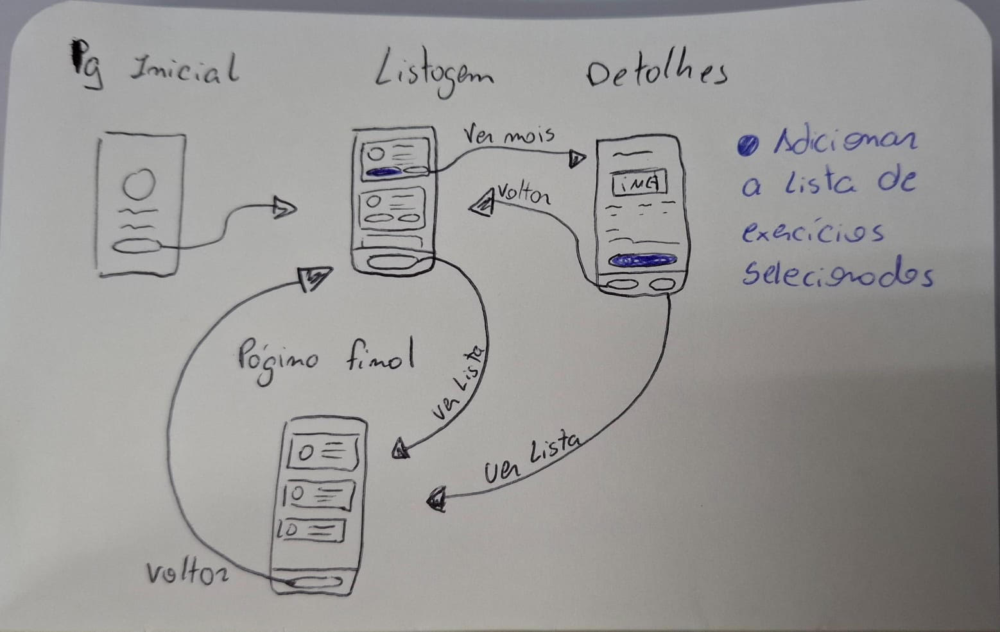

# Proposta de Projeto: Aplicativo para Academia

## 1. Descrição do Tema
O aplicativo serve para ajudar as pessoas a organizarem seus treinos, na academia ou em casa. O objetivo é permitir que o usuário explore uma lista de exercícios registrados, veja como executá-los corretamente e monte sua própria rotina personalizada para o dia.

## 2. Fluxo de Telas e Funcionalidades
### Tela Inicial
- Tela de entrada com o logotipo e uma breve explicação sobre o aplicativo.
- Botão principal escrito "Início" para começar a seleção.

### Tela de listagem
- NavBar no topo com o botão "Ver Treino" e um número ao lado indicando quantos exercicios já foram adicionados.
- Uma lista exibindo os cards de exercícios disponíveis no aplicativo, com breve descrição e imagem.
- Cada card terá dois botões: "Saber Mais" e "Adicionar ao Treino".
- O botão "Adicionar ao Treino" adiciona automaticamente o exercício na lista de treino.
- O botão “Saber Mais” abre a tela de detalhes do exercício.

### Tela de Detalhes
- NavBar no topo com o botão "Ver Treino" e um número ao lado indicando quantos exercicios já foram adicionados.
- Exibe informações detalhadas e um GIF/Imagem mostrando a execução correta.
- Possui o botão "Adicionar ao treino" no final.

### Tela de Resumo
- Exibe apenas os exercícios que o usuário selecionou.
- Botão “Confirmar Treino” para confirmar os exercícios escolhidos.

## 3. Justificativa dos Requisitos Obrigatórios
- R1: O app possui 4 telas: Home, Listagem, Detalhes e Resumo.
- R2 e R3: Uso de Column e Row para estruturar os cards; Uso de Image para exibir os treinos; Padding para ajuste entre os componentes; Text para criar os textos dos exercícios.
- R4: Implementação de uma LazyColumn na tela para o carregamento da lista de exercícios.
- R5: Uso de NavHost e NavController para as rotas dentro do aplicativo.
- R6: O estado da lista de treino usará um StateFlow para reações rápidas.
- R7: O usuário interage através da construção da sua lista de treino.

## 4. Esboço de Telas 
- Home: Logotipo; Resumo; Botão "Iniciar"
- Listagem: NavBar com botão "Ver Treino"; Lista de exercícios com imagem, resumo e os botões "Saber Mais" e "Adicionar ao Treino".
- Detalhes: NavBar com botão "Ver Treino";  Nome e gif com execução do exercício; Explicação do exercício; Botão "Adicionar ao Treino".
- Treino: Lista dos itens selecionados; Botão "Confirmar Treino".

